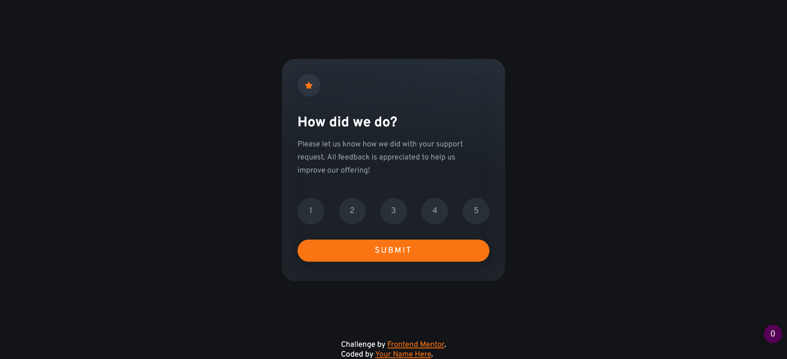

# Frontend Mentor - Interactive rating component solution

This is a solution to the [Interactive rating component challenge on Frontend Mentor](https://www.frontendmentor.io/challenges/interactive-rating-component-koxpeBUmI). Frontend Mentor challenges help you improve your coding skills by building realistic projects. 

## Table of contents

- [Overview](#overview)
  - [The challenge](#the-challenge)
  - [Screenshot](#screenshot)
  - [Links](#links)
- [My process](#my-process)
  - [Built with](#built-with)
  - [What I learned](#what-i-learned)
  - [Continued development](#continued-development)
- [Author](#author)

## Overview

### The challenge

Users should be able to:

- View the optimal layout for the app depending on their device's screen size
- See hover states for all interactive elements on the page
- Select and submit a number rating
- See the "Thank you" card state after submitting a rating

### Screenshot

### Links

- Live Site URL: [Add live site URL here](https://charlesrtb.github.io/interactive-rating-component-main/)

## My process

### Built with

- HTML5 markup
- CSS custom properties
- Flexbox
- SCSS
- Javscript

### What I learned

My biggest learning experience with this project was working with Javascript. This is the first project I have used Javascript outside of tutorials. I wasn't aware of using For loops to iterate over the radio buttons in order to check which one was selcted and return its' value. 

Another challenge was using radio buttons and styling these using CSS to match the brief. I wanted to use radio buttons because I felt this would be semantically correct, perhaps.

### Continued development

The next stage in development is to just continue with more Javascript focused prohects whislt also improving on my HTML and CSS knowledge and skills.

## Author

- Name - Charles Blackie
- Frontend Mentor - [@yourusername](https://www.frontendmentor.io/profile/yourusername)
